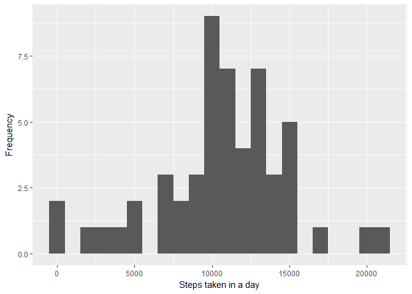
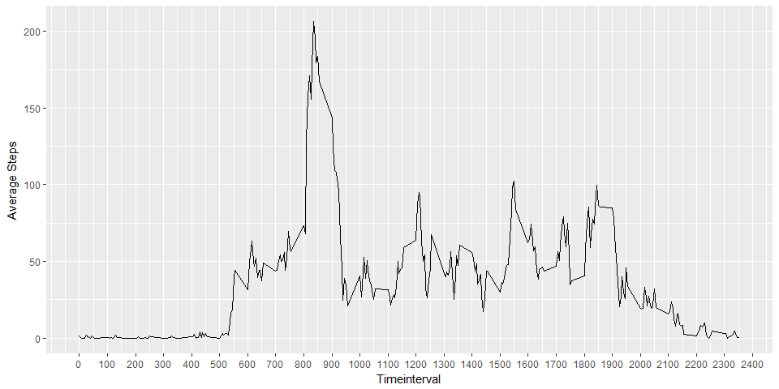
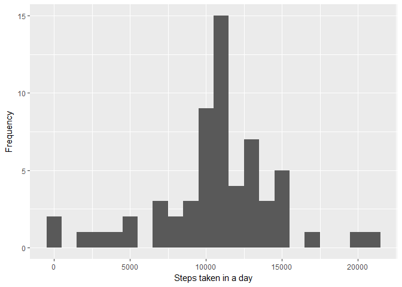
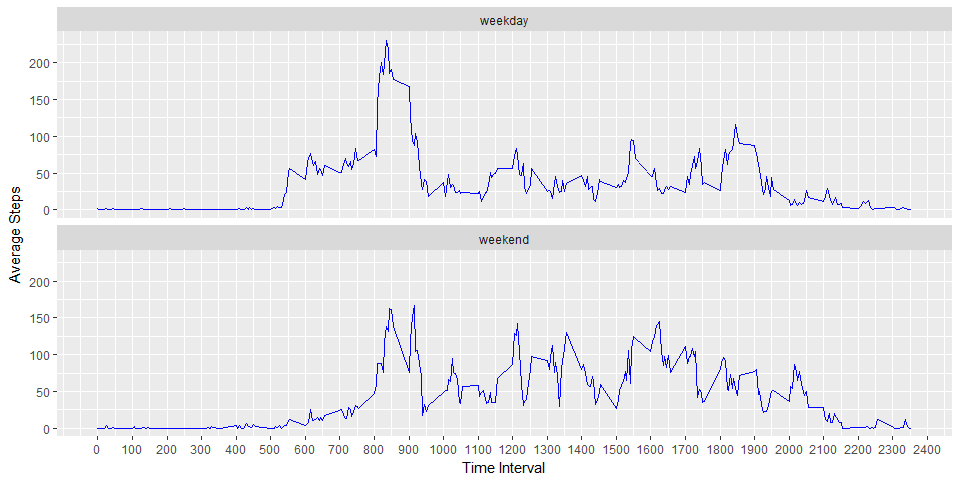

# Reproducible Research: Peer Assessment 1


## Reproducible Analysis - Assignment 1 

This is a analysis of data collected from activity monitoring devices specific to a person.

Data set analysed is from the course project, available as Activity Monnitoring Data in github in the current folder.


## Read dataset

```r
dfactivity = read.csv(unz("./activity.zip","activity.csv"), header=TRUE, sep=",", na.strings = "NA",colClasses=c("numeric","Date","numeric"))
summary(dfactivity)
```

```
##      steps             date               interval     
##  Min.   :  0.00   Min.   :2012-10-01   Min.   :   0.0  
##  1st Qu.:  0.00   1st Qu.:2012-10-16   1st Qu.: 588.8  
##  Median :  0.00   Median :2012-10-31   Median :1177.5  
##  Mean   : 37.38   Mean   :2012-10-31   Mean   :1177.5  
##  3rd Qu.: 12.00   3rd Qu.:2012-11-15   3rd Qu.:1766.2  
##  Max.   :806.00   Max.   :2012-11-30   Max.   :2355.0  
##  NA's   :2304
```

## 1. What is the mean total number of steps taken per day ? 

As seen in the summary, there are dates where there is no steps measured, as this will skew the means, ignore the dates or timeinterval where the steps are null. 

Then, aggregate the steps by date and then plot a histogram forthe steps and its frequency. 


```r
dftotalsteps <- aggregate(formula=steps~date,data=dfactivity,FUN=sum,na.action=na.omit)


ggplot(data=dftotalsteps,aes(x=steps)) +
  geom_histogram(binwidth=1000)+ 
    labs(x="Steps taken in a day",y="Frequency")
```

<!-- -->

As seen in the historgram, around 10,000 steps have the highest frequency. 

This is inferred from the summary of the means and median of the steps below

```r
mean(dftotalsteps$steps) 
```

```
## [1] 10766.19
```

```r
median(dftotalsteps$steps) 
```

```
## [1] 10765
```

##2. What is the average daily activity pattern?

Calculate the average steps based on time interval. 


```r
dfavgsteps <- aggregate(formula=steps~interval,data=dfactivity,FUN=mean,na.action=na.omit)

brks=seq(0,2400,100)


ggplot(data=dfavgsteps,aes(x=interval,y=steps)) +
  geom_line()+
  scale_x_continuous(breaks=brks) +
    labs(x="Timeinterval",y="Average Steps")
```

<!-- -->

From the timeseries, it is inferred that the interval of 800 - 850, has the maximum average steps.

##3.Imputing missing values 

Count of records which are missing values. 


```r
sum(is.na(dfactivity$steps))
```

```
## [1] 2304
```

Filling NAs for missing values, using the average calculated in previous step i.e data set dfavgsteps


```r
dfactivityfill <- merge(x=dfactivity, y=dfavgsteps, by="interval", all = TRUE)

dfactivityfill$steps.x <- ifelse(is.na(dfactivityfill$steps.x) == TRUE, dfactivityfill$steps.y , dfactivityfill$steps.x)

names(dfactivityfill) <- c("interval","steps","date", "avg")


dftotalsteps_2 <- aggregate(formula=steps~date,data=dfactivityfill,FUN=sum,na.action=na.omit)


ggplot(data=dftotalsteps_2,aes(x=steps)) +
  geom_histogram(binwidth=1000)+ 
    labs(x="Steps taken in a day",y="Frequency")
```

<!-- -->

There is a change in frequencies, however the 10,000 steps still have the highest frequency.

This is inferred from the summary of the means and median of the steps below


```r
mean(dftotalsteps_2$steps) 
```

```
## [1] 10766.19
```

```r
median(dftotalsteps_2$steps) 
```

```
## [1] 10766.19
```

## 4. Are there differences in activity patterns between weekdays and weekends?

To observe or view the differences between weekends and weekdays, calculate the weekday indicatir based on the date.


```r
dfactivityfill$dayofweek <- weekdays(dfactivityfill$date)
dfactivityfill$weekdayind <- ifelse( weekdays(dfactivityfill$date) %in% c("Saturday","Sunday"), "weekend", "weekday" )
dfactivityfill$weekdayind<-as.factor(dfactivityfill$weekdayind)
```


Now, calculate the average steps by interval across all days and by the weekedayind.

Plot the timeseries based on the weekdayind, as rows, to view them together to view the differences if any.


```r
dfavgsteps_2 <- aggregate(formula=steps~interval+weekdayind,data=dfactivityfill,FUN=mean,na.action=na.omit)


ggplot(dfavgsteps_2,aes(x=interval,y=steps)) +
  geom_line(col="blue")+
  facet_wrap(~weekdayind,nrow=2) + 
    scale_x_continuous(breaks=brks) +
    labs(x="Time Interval",y="Average Steps")
```

<!-- -->

It is inferred from the above plots, that over the weekdays, we have spike in activity steps, for 8.00 - 9.00. Whereas over the weekend, the activity steps are spread across the day.
